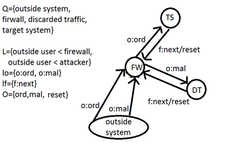
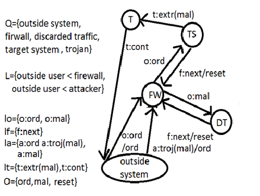

A project for my ICS 355 class where i modeled the use of a Trojan virus to create a covert channel
between some host computer and the attacker. A covert channel is when a channel is used to transmit data 
outside of the systems security. The diagram on the left illustrates how the channel functions with no 
Trojan present and the diagram on the right demonstrates a channel where a Trojan has created a covert
channel.

